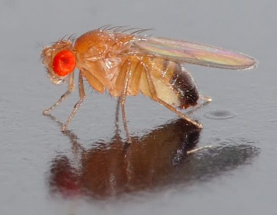

# famous-people

Homemade Cursor skill. One biologist, one scientific life, one Chinese WeChat longread.

自制 Cursor 技能。一位生物学家的科学人生，一篇中文公众号长文。

It checks the sources, finds existing figures, and writes the way a scientist writes for a magazine. It does not post unless you say so.

查证、找现成的图，按科学家给杂志写人物的方式成文。未明确要求时不发布。

## Example / 案例

<p align="center">
  <a href="examples/morgan/article.md">
    
  </a>
</p>

**Morgan** — [full article](examples/morgan/README.md)

托马斯·亨特·摩尔根：果蝇的白眼改变了他对遗传学的看法。九张现成的图，后续写到 2024 年的果蝇全脑。



*安德烈·卡瓦特摄，Wikimedia Commons，CC BY-SA 2.5。*

## Install / 安装

```bash
git clone https://github.com/Xuzhen-Li/famous-people.git
mkdir -p ~/.cursor/skills
ln -sfn "$(pwd)/famous-people" ~/.cursor/skills/famous-bio
```

Needs Python 3.10+. The slash command is `/famous-bio`. This skill is not auto-attached: read `SKILL.md` first, and do not load other skills.

需要 Python 3.10+。命令是 `/famous-bio`。本技能不会自动挂上：先读 `SKILL.md`，不加载其他 skill。

## Use / 用法

In the workspace where you want `work/<slug>/`:

在要写出 `work/<slug>/` 的工作区里：

```text
/famous-bio 写下一篇：托马斯·亨特·摩尔根
```

Four steps / 四步：

1. Research → `work/<slug>/facts.md`（`templates/facts.md`，`references/research.md`）.
2. Draft and figures → `work/<slug>/draft.md`，图放 `work/<slug>/figures/`，登记 `figures.md`（`references/style.md`，`references/figures.md`）.
3. Read aloud, write `revise.md` against the questions at the end of `references/style.md`, then `article.md`.
4. Check: `python3 scripts/check_article.py work/<slug>/article.md`. Fix every ERROR. Read each WARN and decide.

查证、写和配图、按改稿问题自改、跑检查。有 ERROR 就改；WARN 读一下再判断。

Famous lives usually land at 6000–9000 Chinese characters, others at 4000–6000. That length is what you get after the seven parts are actually told: the era, the person, one or two core pieces of work, the lab, how the work was received, what later research did with it up to the present decade, and the late life. It is not a target to pad or to cut toward.

著名人物一般 6000–9000 字，一般人物 4000–6000 字。字数是七样都讲开以后的结果：时代、本人、一两件核心工作、实验室、当时怎样被接受、后人做到今天的进展、晚年。不是凑字或砍字的目标。

Use existing plates and photographs. Do not draw diagrams for the article.

用现成的图版和照片。不为文章自己画图。

## File map / 文件

| Path | Role |
|------|------|
| `SKILL.md` | Agent entry: what the piece is, and the four steps |
| `references/style.md` | How the prose should read, and the revision questions |
| `references/research.md` | Where to look, and how deep |
| `references/figures.md` | Where to find figures, licenses, captions |
| `templates/facts.md` | Fact sheet |
| `scripts/check_article.py` | Mechanical check |
| `scripts/test_check_article.py` | Tests for the checker |
| `examples/morgan/` | One finished article and its figures |

`work/` holds one article's notes and draft. It is gitignored and is not part of this package. So are private exemplars and the previous rebuild notes.

`work/` 是一篇的笔记和成稿，已忽略，不属于本包。私有范文和上一轮重建笔记同样不发布。

## Checker / 检查

From this directory / 在本目录：

```bash
python3 scripts/check_article.py work/<slug>/article.md
python3 scripts/check_article.py work/<slug>/article.md --json
python3 scripts/test_check_article.py
```

Exit 0 means no ERROR. WARN is a reading prompt, not a failure. The checker does not decide whether a fact is true.

退出码 0 表示没有 ERROR。WARN 是给写手看的提示，不是失败。检查器不判断事实对不对。

## License / 许可

MIT for this skill's text and code, including the example article. The example images keep the licenses in `examples/morgan/figures/SOURCES.md`.

本技能的文字和代码为 MIT，案例正文也一样。案例图片的许可写在 `examples/morgan/figures/SOURCES.md`。
