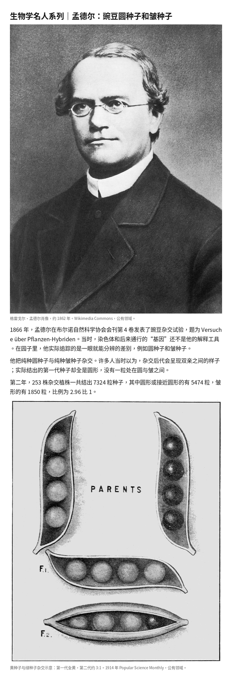

# famous-people

Homemade Cursor skill. One person, one checkable question, one evidence-grounded biography.

自制 Cursor 技能。一人、一个可核对的问题、一篇有证据边界的人物稿。

Not biologists only. The Mendel case below is a worked example, not the scope.

不限于生物学家。下面的孟德尔成稿是工作案例，不是范围。

It writes a Chinese WeChat-ready draft with research, claim boundaries, figure provenance, and mechanical checks kept in separate files. It does not post unless you say so.

写出可供微信阅读的中文稿；研究、主张边界、图源和机械检查分文件保存。未明确要求时不发布。

## Example / 案例

**BG-001 Mendel v21** — [full case](examples/BG-001-mendel-v21/README.md)

Question: why round and wrinkled pea seeds reappear as countable classes, not as a blend.

问题：圆种子和皱种子为什么按可计数的类别再次出现，而不是融合成中间形态。



Files / 文件: [draft.md](examples/BG-001-mendel-v21/draft.md) · [dist.md](examples/BG-001-mendel-v21/dist.md) · [runs/](examples/BG-001-mendel-v21/runs/) · [figures/](examples/BG-001-mendel-v21/figures/)

## Install / 安装

```bash
git clone https://github.com/Xuzhen-Li/famous-people.git
mkdir -p ~/.cursor/skills
ln -sfn "$(pwd)/famous-people" ~/.cursor/skills/famous-people
```

Needs Python 3.10+ and Cursor. Optional companion skills: `references/companion-skills.md`. None are required.

需要 Python 3.10+ 和 Cursor。可选配套技能见 `references/companion-skills.md`，都不是运行依赖。

## Use / 用法

In the workspace where you want `drafts/`, `runs/`, `figures/`, `qc/`, and `dist/`:

在需要写出 `drafts/`、`runs/`、`figures/`、`qc/`、`dist/` 的工作区里：

```text
/famous-people Write one biography of [person], centered on [one checkable question].
```

Then / 然后：

1. Read `SKILL.md` and the root references. / 先读 `SKILL.md` 和根目录参考。
2. Build `runs/<ID>_vN/` (S1 evidence, S2 claim boundary). / 建立 `runs/<ID>_vN/`（S1 证据，S2 主张边界）。
3. Draft Chinese from verified evidence, not from English wording. / 只从已核证据起草中文，不从英文措辞翻译。
4. Run the gates, export a reader-clean file to `dist/`. / 跑检查门，导出读者稿到 `dist/`。

```bash
python3 ~/.cursor/skills/famous-people/scripts/qc_gate.py \
  --profile wechat --file drafts/PERSON_vN.md
python3 ~/.cursor/skills/famous-people/scripts/verify_dois.py \
  --file drafts/PERSON_vN.md --out runs/PERSON_vN/S7-verify-log.txt
python3 ~/.cursor/skills/famous-people/scripts/export_ship.py \
  --in drafts/PERSON_vN.md --out dist/PERSON_vN.md
python3 ~/.cursor/skills/famous-people/scripts/publish_lint.py \
  --file dist/PERSON_vN.md
```

Full steps: [USAGE.md](USAGE.md).

完整步骤见 [USAGE.md](USAGE.md)。

## License / 许可

MIT for code and docs. Example images keep the licenses in that example's `figures/SOURCES.md`.

代码和文档 MIT。案例图片的许可写在该案例的 `figures/SOURCES.md`。
