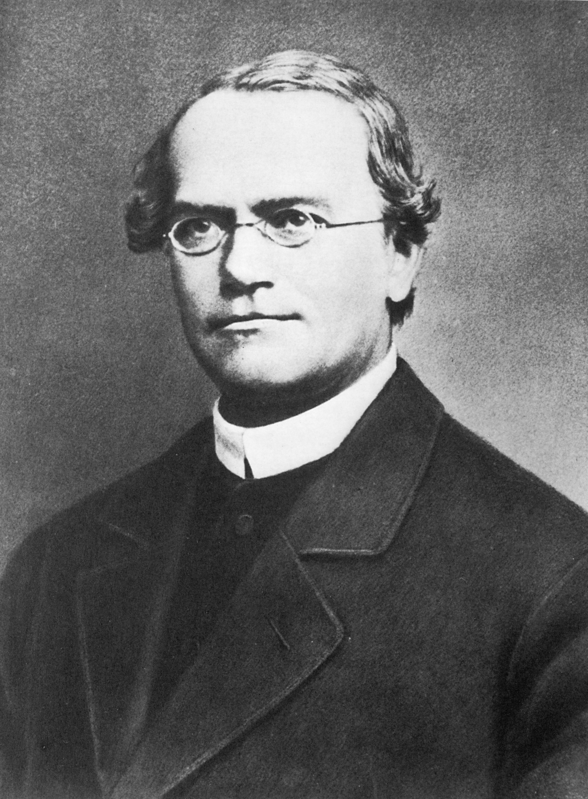
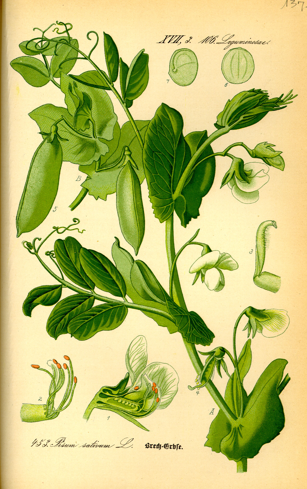
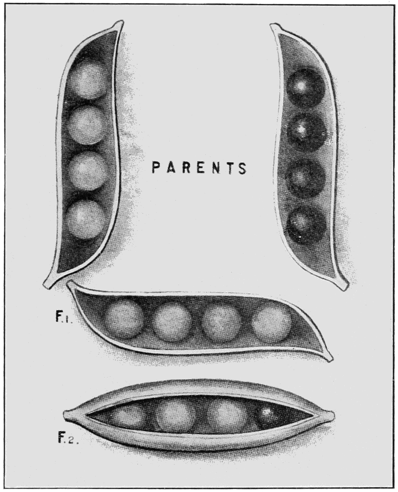
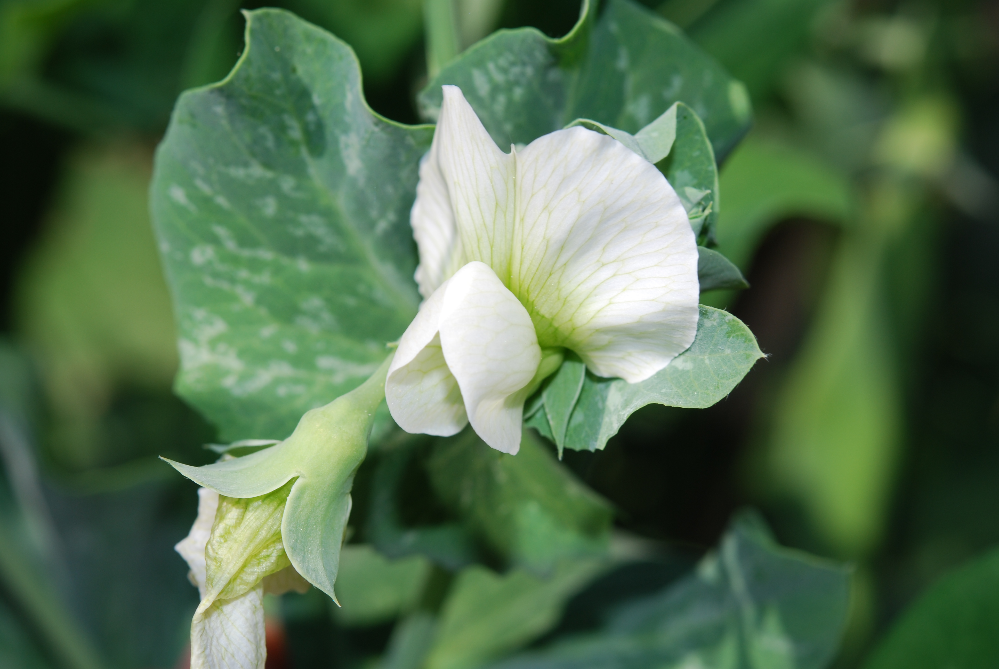
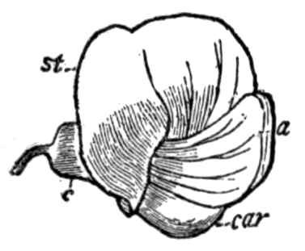
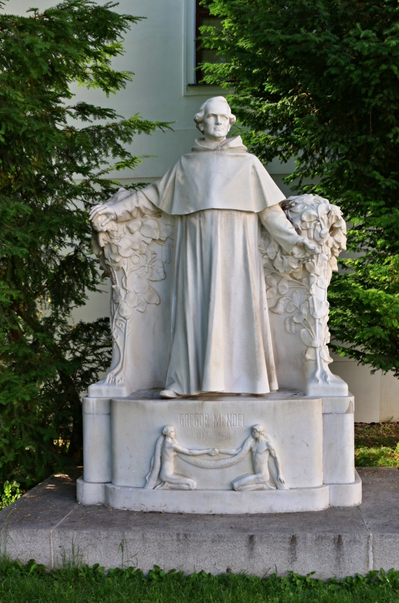
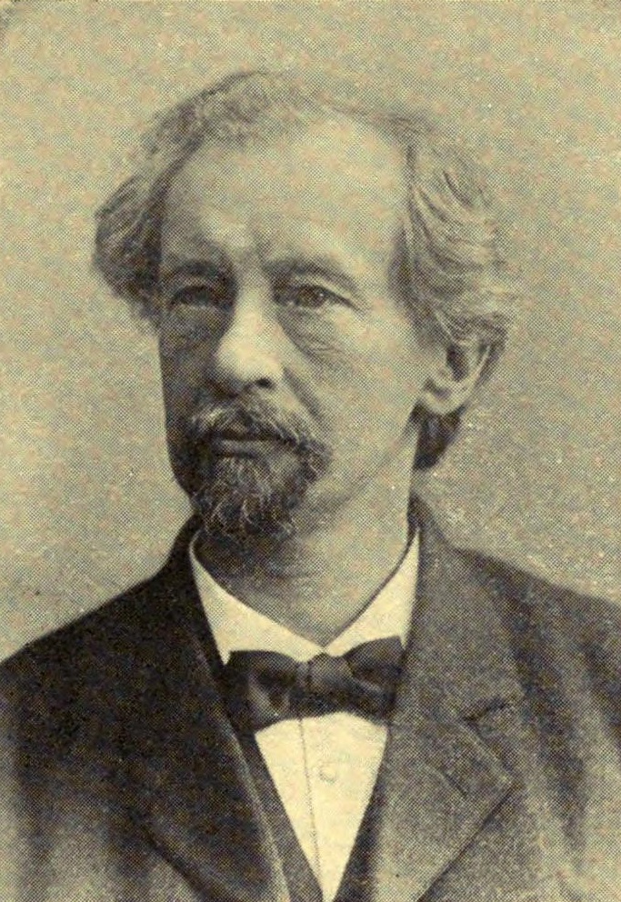

# 生物学名人系列｜孟德尔：豌豆圆种子和皱种子

_格雷戈尔·孟德尔肖像，约 1862 年。来源：Wikimedia Commons 文件页 Gregor Mendel 2.jpg，公有领域。[12]_

1866 年，孟德尔在布尔诺自然科学协会会刊第 4 卷发表了豌豆杂交试验，题为 *Versuche über Pflanzen-Hybriden*。当时，染色体和后来通行的“基因”还不是他的解释工具。在园子里，他实际追踪的是一眼就能分辨的差别，例如圆种子和皱种子。[1]

豌豆既能自花授粉，也能接受人工授粉，彼此相对的性状又容易区分，因此适合连续追踪几代后代。[1] 孟德尔从多家种子商购得材料，先把 34 个品种种了两年，再从中选出 22 个用于杂交。在观察期间，这些品种没有发生会妨碍试验的变化。[1]

他把纯种圆种子与纯种皱种子杂交。许多人当时以为，杂交后代会呈现双亲之间的样子；实际结出的第一代种子却全是圆形，没有一粒处在圆与皱之间。[1] 这次观察只能说明皱种子这一性状没有在第一代表现出来，还不能说明它是否会在后代再次表现。

第二年，253 株杂交植株一共结出 7324 粒种子，其中圆形或接近圆形的有 5474 粒，皱形的有 1850 粒，比例为 2.96 比 1。[1] 第二代中的皱种子仍然具有清楚的皱形，并非圆与皱之间的过渡形态。由此可见，第一代没有表现的性状并未与圆形融合，也没有消失。

7324 粒种子是 253 株的合计数，单株结果可能相差很大。孟德尔记录过一株结出 43 粒圆种子和 2 粒皱种子；把全部植株合并以后，比例才接近 3 比 1。[1] 同一只荚里也常有圆、皱两种种子。发育良好的荚通常含 6 到 9 粒，整荚都是圆种子的情况并不少见，但一荚里的皱种子从未超过 5 粒。无论荚结得早或晚，长在主茎还是侧枝，圆、皱种子的分布都没有系统差别。[1] 因为形状是成熟种子的表面性状，孟德尔按种子计数，而不是按植株计数。[1]

_栽培豌豆植株图版，标出了花、荚和种子。来源：Wikimedia Commons 文件页 Illustration Pisum sativum0.jpg，公有领域。[15]_

换成子叶颜色，孟德尔得到相似的结果。黄、绿两种颜色也能直接从种子上判断。第一代种子全是黄色；第二代绿色种子再次出现。258 株共结出 8023 粒种子，其中黄色 6022 粒，绿色 2001 粒，黄绿数量之比为 3.01 比 1。[1]

_黄种子与绿种子杂交示意：亲本杂交后，第一代全为黄色，第二代约为三黄一绿。原载 1914 年 Popular Science Monthly。来源：Wikimedia Commons 文件页 PSM V85 D331 Results of crossing yellow and green seeded peas.png，公有领域。[16]_

孟德尔用两个词描述这种关系。显性（dominirend）：杂交第一代能够表现出来的性状。在种子形状这一对中，圆是显性；在子叶颜色这一对中，黄是显性。隐性（recessiv）：第一代没有表现、后来能在后代中再次出现的性状。皱和绿分别是这两对性状中的隐性。[1] 这两个词描述性状在后代中的表现方式，并不表示某个性状“更强”或“更好”。

他设想，圆与皱代表两种能够同时存在于杂交植株中的状态。第一代只表现圆形；形成下一代时，两种状态分开，皱形便会按可计数的比例再次出现。他用 A 表示恒定的圆，用 a 表示恒定的皱，用 Aa 表示杂交形式。[1] Aa 种子也是圆形，因此外表同为圆形的种子其实分成两类：一类以后只结圆种子，另一类以后仍会产生圆、皱两种种子。单看这一代分不出来，只能继续种植，观察它们的后代。

## 再种一代，分开两类圆种子

孟德尔种下外表为圆的种子。在长成的 565 株中，193 株以后只结圆种子，372 株仍按大约 3 比 1 产生圆、皱种子；杂交类型与恒定类型之比为 1.93 比 1，接近 2 比 1。[1] 皱种子长成的植株则不再按形状分离。[1] 因而，表面看到的 3 比 1 可以进一步拆成 2 比 1 比 1，写作 A + 2Aa + a。[1]

黄色子叶也能这样拆分。由黄色种子长成的 519 株中，166 株以后只结黄色种子，353 株继续发生分离，两类之比为 2.13 比 1。[1] 种子形状和子叶颜色两项大样本都接近 2 比 1。

试验 1 和试验 2 持续到第 6 代。从第三代开始，孟德尔每代只保留少量植株，后代仍按 2 比 1 比 1 分成杂交与两种恒定类型。[1] 他又假设每株每代只结 4 粒种子，并据此推算到第十代：2048 株中，恒定显性和恒定隐性将各有大约 1023 株，杂交形式只剩大约 2 株，前提是各代育性相同。[1] 按这项推算，杂交形式会逐代减少，两种恒定类型则会占据多数。这是按假说作出的结果；园中实际种植得到的，是此前各代的比例。

一株豌豆会同时表现种子形状和子叶颜色。圆种子可以是黄的，也可以是绿的，皱种子同样如此。如果两对性状在形成后代时彼此牵制，四类种子的数量就不会等于两个 3 比 1 的简单乘积；如果两对性状各自分开，四类数量便应接近 9 比 3 比 3 比 1。

## 形状和颜色会不会互相牵制

孟德尔从 15 株植株上得到 556 粒种子，其中圆黄 315 粒、皱黄 101 粒、圆绿 108 粒、皱绿 32 粒。[1] 四类全部出现，圆黄最多，皱绿最少，另外两类数量相近，整体接近 9 比 3 比 3 比 1。

他在次年继续种这些种子。圆黄一类有 11 粒没有长成植株，另有 3 株没有结种子；皱绿一类长出 30 株，后代性状始终不再分离。[1] 圆黄植株的外表相同，后代却显示它们包含不同组合。孟德尔得到 38 株稳定表现 AB 的植株；另有 65 株和 60 株只在其中一对性状上保持杂交；还有 138 株的两对性状都是杂交形式 AaBb。[1] 九类植株的数量依次为 38、35、28、30、65、68、60、67、138，接近 33、66、132，也就是 1 比 2 比 4。[1] 一对性状可分成一份恒定显性、两份杂交和一份恒定隐性；两对性状分别这样分开，组合后便得到九类。

人工授粉也检验了这个乘积。杂交植株与双显性亲本 AB 相交，两次分别得到 98 粒和 94 粒种子，全部为圆黄。杂交植株与双隐性亲本 ab 相交，一组四类种子为 31、26、27、26，另一组为 24、25、22、27。[1] 四种组合都出现，数量大致相当，这与胚珠和花粉形成数量相近的不同类型相符。部分胚珠不能发育，部分种子以后不能萌发，因此实测数字不必与整数比例完全一致。[1]

三对性状同时杂交更费工。24 株杂交植株共得到 687 粒种子，次年有 639 株结实。[1] 孟德尔逐步增加性状的对数，是为了检验同一套组合规则在两对、三对性状中是否仍然成立。

## 这些计数怎样避免混杂

比例要有意义，首先要分清每一代植株的亲本。孟德尔早年研究观赏植物时已经发现，杂交后代并不总是处于双亲之间；有的第一代偏向一方，有的到后代还会再次分离。[1] 豌豆容易自交，也能人工杂交，正好便于控制亲本。

豌豆花的旗瓣位于上方，翼瓣分居两侧，最里面的两片形成龙骨瓣，将雄蕊和柱头包在其中。花药在花朵开放前已经在花蕾中裂开，柱头会先沾上自身花粉，外来花粉不容易进入。[1]

_栽培豌豆的白花。白花是七对相对性状中花色一对的隐性表型之一。Dyorkey 摄，来源：Wikimedia Commons 文件页 Pisum sativum flower.jpg，CC BY-SA 3.0。[17]_

_豌豆花侧面结构：st 为旗瓣，a 为翼瓣，car 为龙骨瓣，c 为花萼。原载 1911 年 Encyclopaedia Britannica。来源：Wikimedia Commons 文件页 EB1911 Flower of Pea.png，公有领域。[18]_

进行人工杂交时，孟德尔要在花完全展开前打开花蕾，除去龙骨瓣，抽出雄蕊，再授以选定的花粉。这套操作虽然繁琐，却几乎总能成功。[1] 容易自交而又能可靠地人工杂交，使他可以确认后代来自哪一对亲本。

他一共选择了七对相对性状：种子形状、子叶颜色、种皮兼花色、荚形、未熟荚色、花序位置和茎轴长短。[1] 灰褐种皮通常伴随紫红花和叶腋红斑，白种皮总与白花相伴；灰褐种皮放进沸水后会变成深褐色。[1] 这七对性状都没有出现过渡类型。[1] 为了清楚区分茎轴长短，他选用的高株为 6 到 7 英尺，矮株为 3/4 英尺到 1 英尺半；不容易分辨的性状没有进入这套计数。[1]

种子性状按粒计数，植株性状按株计数。荚形共 1181 株，其中拱起 882 株、缢缩 299 株，比例为 2.95 比 1；未熟荚色共 580 株，其中绿色 428 株、黄色 152 株，比例为 2.82 比 1；花序位置共 858 例，其中腋生 651 例、顶生 207 例，比例为 3.14 比 1；花色兼种皮共 929 株，数量为 705 对 224，比例为 3.15 比 1；茎轴共 1064 株，长株 787 株、短株 277 株，比例为 2.84 比 1。矮株被移到单独的畦中，以免让高株遮住。[1] 七项合计后，显性与隐性的平均比例为 2.98 比 1，约为 3 比 1。[1]

在后五项试验中，孟德尔各取 100 株显性表型植株，每株再种十粒种子。他把只产生显性后代的恒定类型列在前，把后代继续分离的杂交类型列在后：花色为 36 对 64，荚形 29 对 71，未熟荚色 40 对 60，花序 33 对 67，茎轴 28 对 72。荚色第一次得到 60 对 40，重做后得到 65 对 35。[1] 种植下一代以后，外表相同的显性植株再次分成了恒定与杂交两类。

孟德尔也记录了可能干扰判断的情况。有些绿色子叶颜色不够明显，容易漏看；这种差异来自个体发育，不会遗传，也与植株是否杂交无关。[1] 虫害和过早采荚会改变种子的颜色与形状。[1] 正交与反交得到的植株没有差别，所以他把两者合并计数。[1]

授粉只选长势最好的植株。第一项试验用 15 株完成 60 次授粉，第二项用 10 株完成 58 次授粉。[1] 多数植株种在畦中，少数采用盆栽；其中一部分盆栽植株在开花期移入温室，以便与可能受昆虫干扰的露地植株比较。[1] 豌豆象（*Bruchus pisi*）会在花中产卵，并撑开龙骨瓣。孟德尔检查了超过 1 万株植株，只发现很少能够确定的误授粉，温室内则没有发现。[1]

这项工作在一个较小的植物类群上持续了八年。大体完成后，孟德尔于 1865 年 2 月 8 日和 3 月 8 日在布尔诺自然科学协会宣读报告，论文于 1866 年刊登在会刊第 4 卷。[1]

_布尔诺旧布鲁诺修道院外的孟德尔雕像。VitVit 摄，来源：Wikimedia Commons 文件页 Starobrněnský klášter Mendel socha.jpg，CC BY-SA 4.0。[13]_

## 为什么过了三十四年才被重新看见

1900 年前后，de Vries、Correns、Tschermak 等人的论文再次把分离现象带到遗传研究的中心，后来教科书把这段历史称为“再发现”。[2] 这个词容易让人误以为孟德尔的论文曾经彻底消失。Fisher 查到，1900 年以前至少有 Focke 的《植物杂种》和 Hoffmann 的一处文字引用过它。[3] 论文有人见过，只是这些计数没有形成持续的研究讨论。

Fisher 因此要求重新审查“三十四年后重新发现”的传统叙述。[3] 少量引文说明论文仍在流通，也说明被引用和被研究者反复使用是两回事。到 1900 年前后，几位植物学家已经有了自己的杂交结果，孟德尔的比例开始进入他们正在进行的比较和争论。[2]

Kottler 在 1979 年考察了 de Vries 的发表记录。de Vries 自称在读到孟德尔论文以前已经发现相关定律；他在 1897 年公布的杂交第二代比例为 2/3 比 1/3，以及 80% 对 20%，到 1900 年才改写成 3 比 1。[2] 比例改变后，那张 1896 年、后来被当作 3 比 1 证据的表仍与当年发表的记录不符。[2] de Vries 在 1903 年德文版《突变论》第二卷中描述的孟德尔式试验，又在 1910 年英译本中被整段删去。[2] 这些改动使后来所谓的“再发现”带上了回顾时的重写与争议。

_雨果·德弗里斯肖像。来源：Wikimedia Commons 文件页 Portrait of Hugo de Vries.jpg，公有领域。[14]_

孟德尔的数据后来还引发了另一场争论。Fisher 在 1936 年发表 *Has Mendel's work been rediscovered?*，文章刊于 Annals of Science 第 1 卷 115 到 137 页。[3] 他怀疑公布的数据与理论比例吻合得过好，并追问实验步骤能否按字面重建。Hartl 与 Fairbanks 回顾这场争议时，反对把统计上的疑问直接等同于伪造。[4] 孟德尔原文给出了总分母，也保留了单株 43 对 2 这样的偏离。[1] 总数接近 3 比 1，不能抹去单株波动；单株波动本身也不能证明总数遭到编造。

孟德尔的论文早年留下过少量引文，却没有被连续使用；到了 1900 年前后，新的杂交研究和优先权争议又把这些数字带回讨论。[2][3] 这三十四年记录了论文从零星引用进入集中讨论的过程。

## 圆和皱后来对应什么

1990 年，Bhattacharyya、Smith、Ellis、Hedley 和 Martin 在 Cell 报告，孟德尔所说的皱种子对应淀粉分支酶基因中的一段转座子样插入。[8] 蛋白电泳显示，皱种子材料中看不到相应的酶带。淀粉减少、蔗糖增多以后，发育中的种子吸收更多水分；种子成熟时失水也更多，种皮不能随子叶一起充分收缩，表面因此形成皱褶。[8] 当时测得插入约为 0.8 kb。[8] 这项研究把成熟种子的皱褶连到了一条具体的分子路径上。

把这些性状放到染色体坐标上，还需要参考基因组。2019 年至 2022 年间，栽培豌豆组装和泛基因组研究把株高 *Le*、种子形状 *R* 重新对应到数量性状位点。[9][10] 2011 年前后，七对性状中只有四对的分子基础比较清楚。[5][6] 2025 年 4 月，Feng、Cheng 及合作者在 Nature 报告了余下三对性状的分子基础，并为已经克隆的四对补充了新等位；研究材料来自约翰·英尼斯中心种质库的 697 份种质。[7]

[Feng 等 2025 年 Nature 论文图 2 可在 DOI 页面查看](https://doi.org/10.1038/s41586-025-08891-6)。该图左列展示七对相对性状的表型，中列为全基因组关联结果，右列为等位在基因上的差异；圆与皱对应淀粉分支酶基因末尾的一段插入。[7]

图 2 的中列以染色体位置为横轴、关联强度为纵轴，每对性状都在一段染色体上形成高峰，研究者据此寻找相应基因。[7] 右列进一步把关联峰落到基因模型上。圆、皱这一对对应淀粉分支酶基因最后一个外显子中的插入，文中称为 *Ips-r*，其完整序列列在 Supplementary Fig. 2。[7] 左列则展示每对性状在种子或植株上的样子。

圆与皱仍对应淀粉分支酶 *PsSBEI*，这对差异也是种子蛋白质含量变异的主要来源。[7] 同年，Nature Plants 的一篇评述认为，余下三对性状的分子基础已经补齐，这些基因也是豌豆表型变异的重要贡献者。[11] 一百六十多年以后，Cell、Nature Genetics 和 Nature 的研究仍在沿着这些相对性状追问分子原因。[7][8][9][10] 1866 年留下的是可重复计数的圆与皱；今天，研究者还在利用这对差异理解豌豆种子的蛋白质含量。

## 这三十四年留下的启示

孟德尔报告了 253 株植株合计结出的 7324 粒种子，也留下单株 43 粒圆种子对 2 粒皱种子的明显偏离。[1] 后来的人因此可以看清总比例的分母，也知道单株之间会有多大波动。他还把外表为圆的种子继续种下去，观察下一代会一直结圆种子，还是重新产生圆、皱两类。[1] 发表只完成了科学工作的第一步。样本、偏离和下一次检验都写清楚，别人才有可能把结果接着做下去。

把这段历史写成“天才等待后人证明正确”，会漏掉其中的曲折。孟德尔的论文在 1900 年前已有 Focke 和 Hoffmann 引用。[2][3] 后来所谓的“再发现”，又伴随 de Vries 对比例、表格和文本作回顾性改写。[2] Feng 等人在 2025 年分析约翰·英尼斯中心种质库的 697 份种质，用全基因组关联研究把七对表型与染色体上的关联峰和候选基因对应起来。[7] 一百六十多年后，圆与皱仍然可以换一批样本、换一种方法，继续接受检验。

## 参考来源

[1] Mendel G (1866). Versuche über Pflanzen-Hybriden. *Verhandlungen des naturforschenden Vereines in Brünn* 4, 3-47. DOI [10.5962/bhl.title.61004](https://doi.org/10.5962/bhl.title.61004). 文本 [deutschestextarchiv.de](https://www.deutschestextarchiv.de/mendel_pflanzenhybriden_1866)

[2] Kottler MJ (1979). Hugo de Vries and the rediscovery of Mendel's laws. *Annals of Science* 36, 517-538. DOI [10.1080/00033797900200351](https://doi.org/10.1080/00033797900200351)

[3] Fisher RA (1936). Has Mendel's work been rediscovered? *Annals of Science* 1, 115-137. DOI [10.1080/00033793600200111](https://doi.org/10.1080/00033793600200111)

[4] Hartl DL, Fairbanks DJ (2007). Mud sticks on the alleged falsification of Mendel's data. *Genetics* 175, 975-979. DOI [10.1093/genetics/175.3.975](https://doi.org/10.1093/genetics/175.3.975)

[5] Reid JB, Ross JJ (2011). Mendel's genes toward a full molecular characterization. *Genetics* 189, 3-10. DOI [10.1534/genetics.111.132118](https://doi.org/10.1534/genetics.111.132118)

[6] Ellis THN et al. (2011). Mendel, 150 years on. *Trends in Plant Science* 16, 590-596. DOI [10.1016/j.tplants.2011.06.006](https://doi.org/10.1016/j.tplants.2011.06.006)

[7] Feng C et al. (2025). Genomic and genetic insights into Mendel's pea genes. *Nature* 642, 980-989. DOI [10.1038/s41586-025-08891-6](https://doi.org/10.1038/s41586-025-08891-6)

[8] Bhattacharyya MK, Smith AM, Ellis THN, Hedley C, Martin C (1990). The wrinkled-seed character of pea described by Mendel is caused by a transposon-like insertion in a gene encoding starch-branching enzyme. *Cell* 60, 115-122. DOI [10.1016/0092-8674(90)90721-p](https://doi.org/10.1016/0092-8674(90)90721-p)

[9] Kreplak J et al. (2019). A reference genome for pea provides insight into legume genome evolution. *Nature Genetics* 51, 1411-1422. DOI [10.1038/s41588-019-0480-1](https://doi.org/10.1038/s41588-019-0480-1)

[10] Yang T et al. (2022). Improved pea reference genome and pan-genome highlight genomic features and evolutionary characteristics. *Nature Genetics* 54, 1553-1563. DOI [10.1038/s41588-022-01172-2](https://doi.org/10.1038/s41588-022-01172-2)

[11] Ross JJ (2025). Beyond the identification of Mendel's genes. *Nature Plants* 11, 1474-1475. DOI [10.1038/s41477-025-02071-0](https://doi.org/10.1038/s41477-025-02071-0)

[12] Wikimedia Commons. [File:Gregor Mendel 2.jpg](https://commons.wikimedia.org/wiki/File:Gregor_Mendel_2.jpg)

[13] Wikimedia Commons. [File:Starobrněnský klášter Mendel socha.jpg](https://commons.wikimedia.org/wiki/File:Starobrn%C4%9Bnsk%C3%BD_kl%C3%A1%C5%A1ter_Mendel_socha.jpg). VitVit.

[14] Wikimedia Commons. [File:Portrait of Hugo de Vries.jpg](https://commons.wikimedia.org/wiki/File:Portrait_of_Hugo_de_Vries.jpg)

[15] Wikimedia Commons. [File:Illustration Pisum sativum0.jpg](https://commons.wikimedia.org/wiki/File:Illustration_Pisum_sativum0.jpg)

[16] Wikimedia Commons. [File:PSM V85 D331 Results of crossing yellow and green seeded peas.png](https://commons.wikimedia.org/wiki/File:PSM_V85_D331_Results_of_crossing_yellow_and_green_seeded_peas.png)

[17] Wikimedia Commons. [File:Pisum sativum flower.jpg](https://commons.wikimedia.org/wiki/File:Pisum_sativum_flower.jpg). Dyorkey.

[18] Wikimedia Commons. [File:EB1911 Flower of Pea.png](https://commons.wikimedia.org/wiki/File:EB1911_Flower_of_Pea.png)
