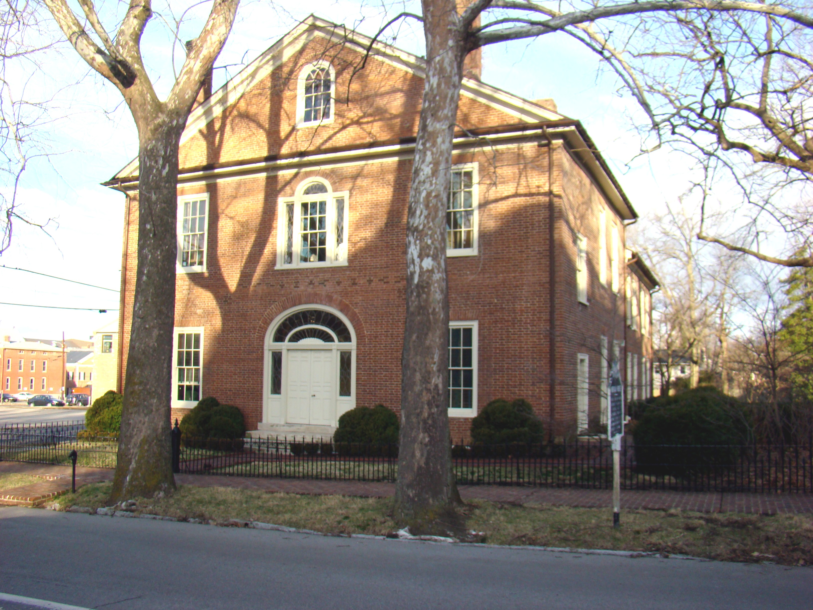
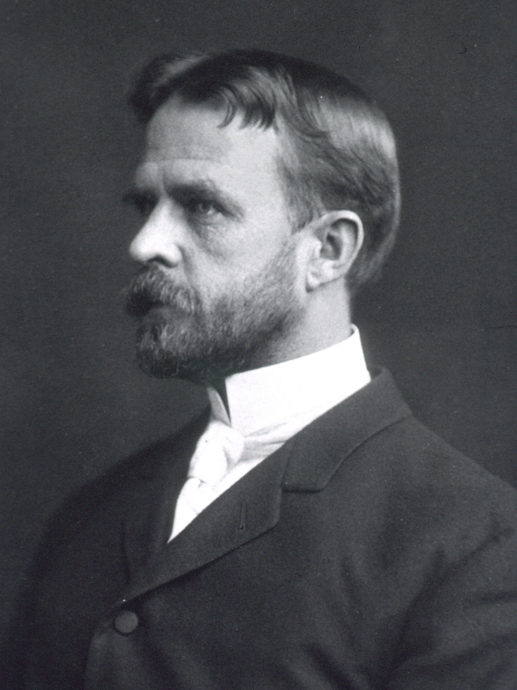
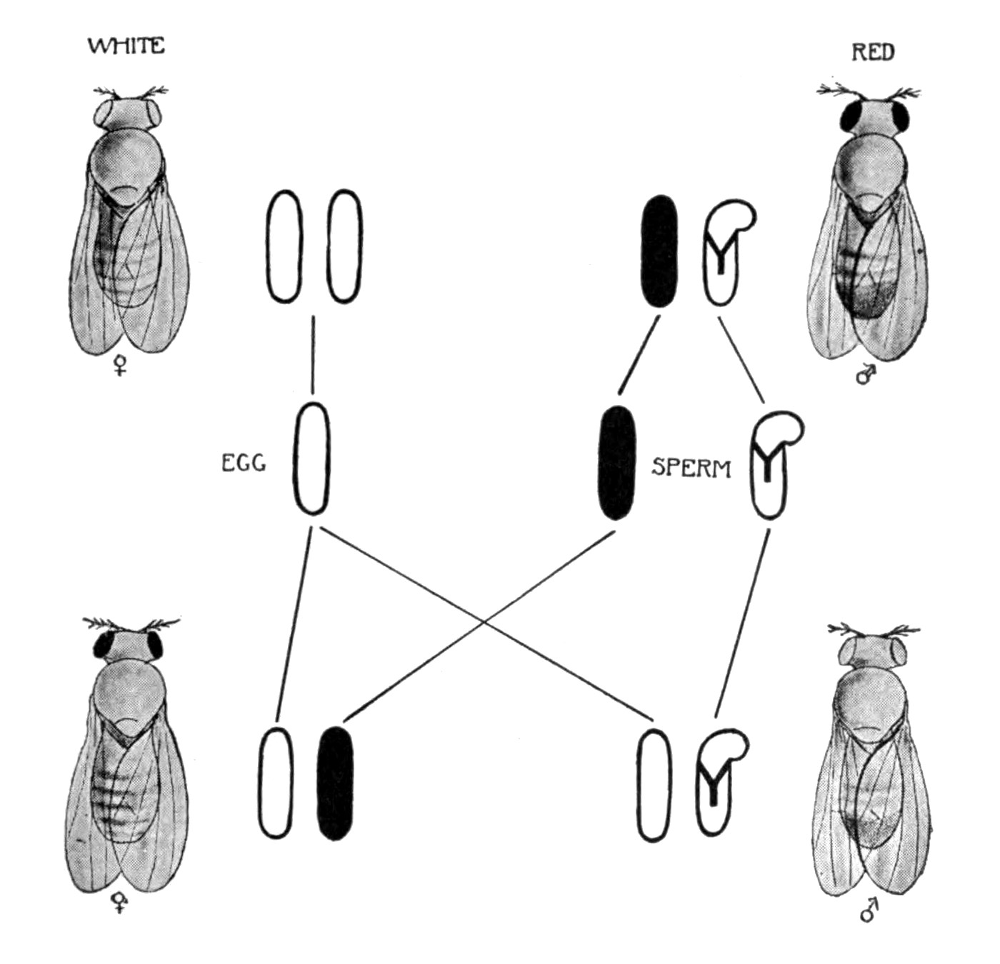
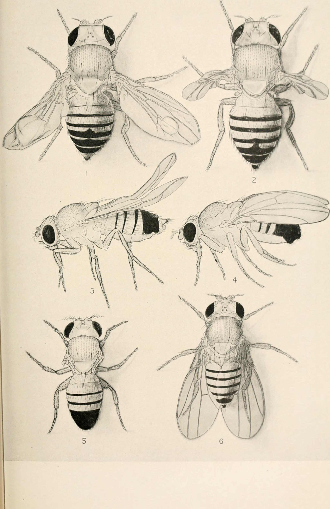
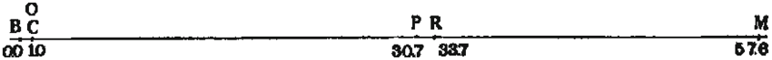
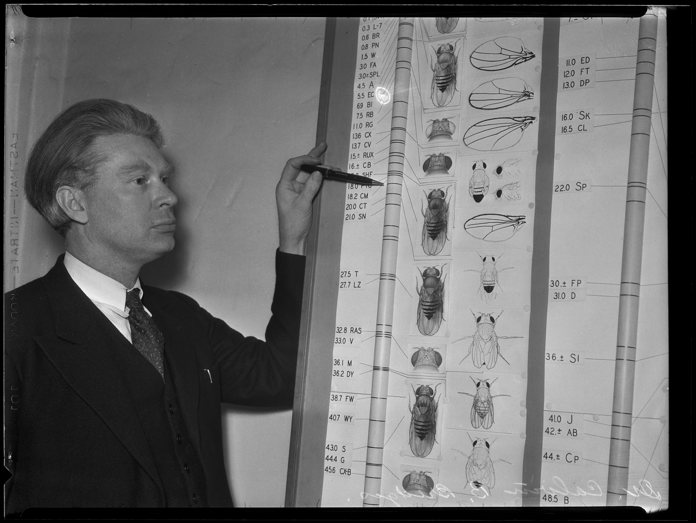
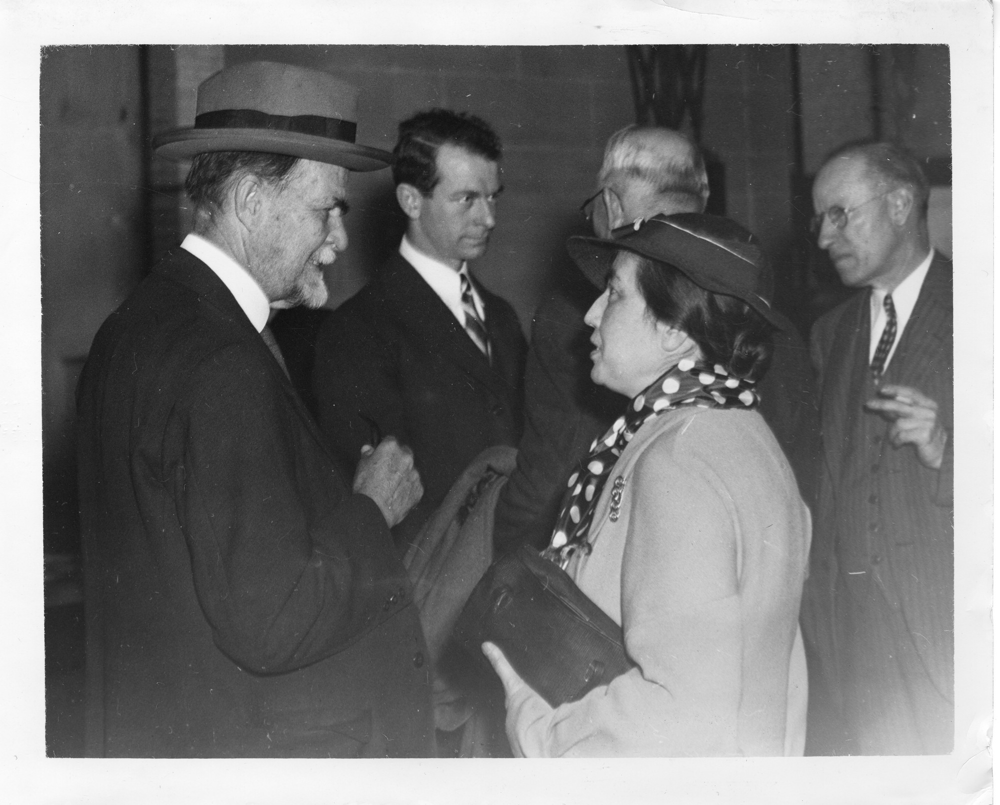
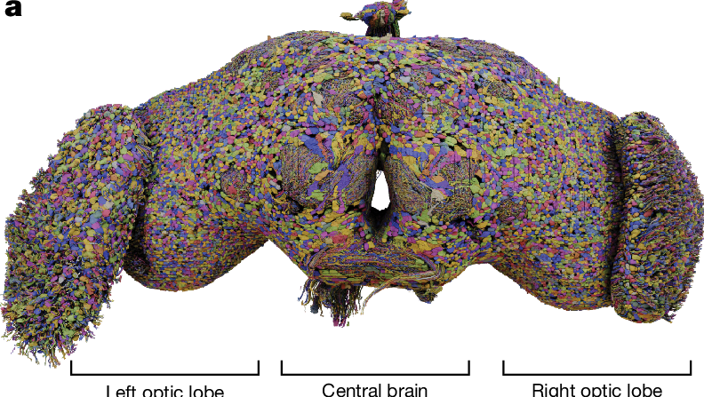

# 生物学名人系列｜托马斯·亨特·摩尔根：果蝇的白眼改变了他对遗传学的看法

## 伍兹霍尔的白眼

1910 年 7 月 7 日，托马斯·亨特·摩尔根在马萨诸塞州伍兹霍尔写下日期，要讲的是实验室里已经连续养了将近一年的一瓶果蝇。寻常果蝇的眼睛是亮红色的，这一瓶里却出现了一只眼睛发白的雄蝇。那一年他四十三岁，在哥伦比亚大学已经教了六年书。养这瓶蝇并不是因为手里已经有一套染色体理论，专等一只白眼来填空，而是白眼在照旧养着的蝇里自己出现的。短文登在 7 月 22 日的《科学》上，地点就署着伍兹霍尔。5 月 18 日他已经在实验生物学与医学会上讲过这只雄蝇和它的红眼子女，把眼色怎样跟着性别走数清楚，则是 7 月这篇。[1][13]

今天它叫黑腹果蝇，身体只有两三毫米，喂一次能养很多只，占地方又小，所以想在一年里看许多代怎样传递，这种动物正合用。[1][9]

*2005年拍摄的一只雄性黑腹果蝇，眼睛是野生型的红色。安德烈·卡瓦特摄，Wikimedia Commons，CC BY-SA 2.5。*

## 从列克星敦出发

1866 年 9 月 25 日，他生在肯塔基州列克星敦，是查尔顿·亨特·摩尔根和埃伦·基·霍华德的儿子。查尔顿做过美国驻墨西拿的领事，协助过加里波第，回到美国以后又参加南部邦联的军队，并在希洛受过伤。十岁上下，摩尔根就在乡下捡鸟、鸟蛋和化石，有的夏天还住到马里兰州最西边的山里去拣化石。[9][13]

*2008年的列克星敦亨特-摩尔根宅，1814年由约翰·韦斯利·亨特所建。托马斯·亨特·摩尔根在列克星敦住过这里。弗洛奈特与拉塞尔·普尔摄，Wikimedia Commons，CC BY-SA 4.0。*

1886 年他从肯塔基大学毕业，随后到过波士顿北面安尼斯夸姆的海边实验室。1888 年夏天他在伍兹霍尔为美国渔业委员会做事，1890 年又到了那里刚兴起来的海洋生物实验室，海洋里的动物从此跟着他。1897 年起他做了这个实验室的理事，夏天长期回去，几乎一直到晚年。[9][10][13]

1890 年他在约翰斯·霍普金斯大学拿到博士，题目是海蜘蛛的胚胎，材料是在伍兹霍尔采的。那时候动物学的本行是把构造描清楚，再拿来比较亲缘，老师布鲁克斯教形态，纽厄尔·马丁教生理，马丁又是赫胥黎的学生。后来长期跟摩尔根工作的阿尔弗雷德·斯特蒂文特认为，摩尔根不满足于描记、总想动手试，这一路是从马丁那里来的。[9][10]

同一年他第一次到那不勒斯的动物学实验站，1894 年到 1895 年在那里住了十个月，1900 年夏天又去。在实验站上他和汉斯·德里施一起做胚胎实验，把卵切开，或放进改变了的海水里，问的是各部分各干各的，还是彼此牵制着才长成一只动物。德里施这个人他觉得能谈，两人一直是朋友，可是德里施后来转向生机论，用一种生命自身的目的去解释发育，摩尔根就完全不能跟着走了。[9][13]

1891 年他到布林莫尔学院教生物学，一直待到 1904 年。这一年他和学院的学生莉莲·沃恩·桑普森结婚，两人后来有一个儿子、三个女儿。也是 1904 年，埃德蒙·威尔逊把他请到哥伦比亚大学做实验动物学教授。威尔逊是系里的细胞学家，正在看染色体怎样分进生殖细胞，两人于是共事二十四年，实验室离得近，研究生也常两边跑。[9][10]

## 他当时的怀疑

20 世纪初，孟德尔在 1865 年写下的杂交规律被重新提出来，德弗里斯、科伦斯和切尔马克在植物里看到了分离。过了一两年，贝特森、庞内特和居埃诺又在动物里看到类似的比例。1902 年，威尔逊实验室里的学生威廉·萨顿指出，生殖细胞成熟的时候染色体成对分开，正好供给孟德尔所要求的那种机制，因为每一种遗传单元进到成熟的生殖细胞里只留一份。[8]

摩尔根没有把这件事当成已经证明，因为他怀疑魏斯曼那类粒子：粒子看不见，性质却正好按要解释的结果来派，实验上也不知道从哪里下手。伍兹霍尔的主任惠特曼养鸽子多年，杂交出来的羽色混成一片，并不是干净的三比一，所以谁要是再假定有许多基因同时管着同一件性状，摩尔根觉得只是为了保住一个还没站稳的说法。1909 年他仍然说，在当时对孟德尔学说的解释里，事实正在飞快地被变成因子，斯特蒂文特后来也愿意把大约 1910 年的他称作反孟德尔的。[10][13]

从 1906 年起，他做蚜虫和根瘤蚜的生活史。这些昆虫雌的、雄的、不经受精就发育的换来换去，乍看和染色体对不上，可是他把该看的阶段看仔细以后，结果反而只有用染色体才讲得通。他不肯接受的是另一件事，那就是为了凑已经知道的比例，把看不见的因子一个一个造出来。[13]

他自己想找的是突变。大约 1900 年他到荷兰看过德弗里斯的月见草园。1903 年他还说，谁要是像他那样亲眼见过那座实验园，不可能不留下深的印象，因为园里突然冒出许多和原来的植株差得很远的类型，而且能照新的样子遗传下去。后来才知道，这是月见草本身的遗传方式造成的，并不能支撑德弗里斯当时所下的结论。摩尔根当时看中这些新类型，是因为可以躲开自然选择，在他看来，把选择讲到极处的那些说法带有目的，实验上也推不下去。[13]

果蝇就是为了自己试突变才养起来的。他试过改变温度，也试过盐、糖、酸和碱，还用过镭和射线，可是处理过的瓶子和没处理的对照里，突变出来的机会差不多，以当时的办法看不出辐射有没有把突变提高。处理后偶尔出现的那几只，他归到偶然，突变却自己来了，第一只真正要紧的就是那只白眼雄蝇，而且它和性别绑在一起。[10][13]

果蝇进实验室，比这只白眼更早。1900 年到 1901 年，加利福尼亚大学的昆虫学家伍德沃思正在哈佛，向同在哈佛的卡斯尔提议用这种蝇，因为便宜，地方也小，卡斯尔和同事就在 1906 年拿它做过近亲繁殖。摩尔根在实验动物学的课上用过那篇报告，知道这种动物好养，又知道冷泉港的卢茨正在养，于是向卢茨要了一瓶。斯特蒂文特还记得，早期有些蝇是在伍兹霍尔的杂货店里收集的，到了哥伦比亚的房间里，饲料就是香蕉，角落里常常挂着一把。[9][10][13][14]

*1891年，约翰斯·霍普金斯大学年鉴用过的摩尔根肖像。拍摄者不详，Wikimedia Commons，公有领域。*

## 白眼和性别

那只白眼雄蝇先和它的红眼姊妹交配，子一代数出 1237 只红眼，另外还有 3 只白眼雄蝇，他当作又一次新的突变，这一次先放下不谈。子一代彼此交配，孙代是 2459 只红眼雌蝇、1011 只红眼雄蝇、782 只白眼雄蝇，白眼雌蝇却一只也没有。[1]

红眼一共三千多只，白眼七百多只，并不是不多不少的三比一，雄蝇也比雌蝇少，可是方向清楚，白眼全部落在雄的身上。他当时把这叫做性限遗传，意思是新性状传到了孙子，没有传到孙女，白眼和做一只雌蝇却并不是不能相合。他把最初那只白眼雄蝇后来又和它的一些女儿交配，得到 129 只红眼雌蝇、132 只红眼雄蝇、88 只白眼雌蝇、86 只白眼雄蝇，四类都有，于是记成大约各占四分之一。[1]

若只看白眼只给雄的，会以为雌蝇不能有白眼，回交却把这个想法排除了，因为白眼可以出现在雌蝇身上，只要配偶选对。所以限制不在身体，而在传递的路径，眼色跟谁走，要看精子和卵各带了什么。[1]

他当时用的词是因子。假定白眼雄蝇的精子都带白眼因子，其中一半还带一个他记作 X 的性因子，另一半不带，雄蝇对性别就是杂合的。红眼雌蝇的卵每一粒都带红眼因子，也都带一个 X，两种精子和这种卵相配，子一代要么是红眼雌蝇，要么是红眼雄蝇。这些女儿从父亲那里接过了白眼因子，只是红眼把它盖住了，所以眼睛看上去仍是红的。[1]

女儿再和红眼兄弟交配，关键在兄弟的精子怎样组成，必须假定红眼因子和 X 留在同一种精子里，另一种精子两样都不带，女儿的卵则一半带红眼，一半带白眼。四种搭配里，白眼因子若配到不带 X 的精子上，长出来的是白眼雄蝇，要得到白眼雌蝇，得两份白眼因子碰在一起，这一代却配不出来。于是预期是红眼三、白眼一，而且白眼全是雄的。他另外写下一句：这个红眼因子和性因子是结合着的，从来没有分开存在过。[1]

这套排法可以反过来检验，他也都做了。白眼和白眼交配，后代全是白眼，雌雄大约各半。子二代的红眼雌蝇有两种，一种和白眼雄蝇交配，子女全是红眼，另一种会把红眼、白眼、雌的、雄的四类都生出来。子一代的红眼雌蝇则一律是杂合的，和任何一只白眼雄蝇交配，四类都会出现。[1]

最出乎意料的是白眼雌蝇配一只野生的红眼雄蝇，也就是没有亲缘的那一瓶里的雄蝇，结果女儿全是红眼，儿子全是白眼。他由此认为野生雄蝇对红眼也是杂合的，野生雌蝇才两边都是红眼，因为野生雄蝇只有一份红眼因子，而且这份因子和 X 在一起，只传给女儿。传给儿子的那种精子不带它，儿子的眼色就只看来自母亲的那一份。反过来，白眼雄蝇配野生的红眼雌蝇，儿子和女儿都是红眼，数目也接近，因为野生雌蝇把红眼因子给了每一粒卵。[1]

同一年，他拿这组和英国人的尺蛾对照。庞内特和雷纳研究的醋栗尺蛾，那种突变在自然界只见到雌的，果蝇这边他当时只得到雄的。尺蛾的野生雌性对体色和性别是杂合的，果蝇则是雄性杂合，两边一正一反，正好互相补上。细胞学里，史蒂文斯和威尔逊已经在不少昆虫中看见雄性才是杂合的那一性，蛾和鸟的杂交却像雌性才是杂合的。两套材料原先互相打架，果蝇才把杂交的结果和染色体的图像放进了同一种动物。[1][13]

至于突变是怎样来的，他设想红眼因子从一粒卵里掉了出去，这粒卵又碰上不带 X 的精子，才长成那只白眼雄蝇。若是带 X 的精子碰上同一粒卵，应当先得到一只杂合的红眼雌蝇，下一代里白眼雄蝇大约占四分之一，可是这样成批出现的白眼他当时还没有见到，就把原因暂且放在受精的时候有所选择。[1]

白眼这篇刊出后不到一个月，《美国博物学家》登出他的长文《染色体与遗传》，全文却没有提到果蝇。他先重述萨顿的想法，若每个孟德尔性状坐在一条特定的染色体上，减数分裂就解释了生殖细胞为什么会分成两种，紧接着却是反对。染色体的数目少，性状的数目多，许多性状就得挤在同一条染色体上，于是应当成组地一起分离，可是他觉得事实不是这样。已知的例子里一起走的性状很少，也看不出是因为它们共用一条染色体，豌豆和金鱼草里能够单独分离的性状，数目看起来还比染色体多。只要理论仍要把每一个性状放进一条单独的染色体，性状并不按染色体的数目结成大组，在他看来就是对这个理论的致命反对。[2]

所以 1910 年夏天，白眼的计数已经表明眼色因子和性别绑在一起，他同时发表的长文却把不成组当作染色体理论过不去的关口。7 月那篇用的 X 是一个性因子，到了 8 月的长文里，他也不愿把雄性说成仅仅因为少了什么才成为雄性，更不赞成把某一个具体性状指派给单独一条染色体。[1][2]

1911 年 9 月 10 日，他把另一条路提交给《科学》，9 月 22 日刊出。贝特森和同事收集了一批性状，两种性状到了下一代并不各走各的，比例对不上自由组合，于是他们假定因子在生殖细胞里相吸或者相斥，还要排一个谁优先于谁。贝特森自己说，这种区别的本质是什么，他们还提不出一个说得通的猜测。[3]

摩尔根认为，吸引、排斥和优先次序都可以放下。如果代表因子的物质在染色体里面，会相伴的那些因子又在一条直线上彼此靠近，同源染色体配成对、扭在一起再分开的时候，靠近的就更容易留在同一侧，离得远的则两边都可能去。比利时的詹森斯在 1909 年描写过一种蝾螈的染色体缠在一起，并把这解释成同源染色体之间交换了一段，摩尔根就把果蝇的眼色、体色、翅膀，以及他所谓雌性的性因子，接到这幅图像上。[3]

靠近的因子结成伴，远的看起来就几乎自由组合，所以数出来的比例表示的是位置，不只是一套临时规定的数字。细胞学供给了实验所要求的那种机制。[3]

这一步回答的，正是他自己一年前的反对。许多性状可以在同一条染色体上，所以性状可以比染色体多，可是它们又不是永远锁死。距离近就常常一起走，距离远则交换一多，看不出组，成组是有的，松紧要看位置。1910 年 7 月的白眼只是一个因子和性因子绑在一起，到了 1911 年，眼色、体色和翅膀一起放进来，部分相伴才变成一条可以排位置的线。[2][3]

1915 年，他和斯特蒂文特、赫尔曼·穆勒、卡尔文·布里奇斯把这套说法收进《孟德尔遗传的机制》。书里有一张杂交图，画的就是白眼雌蝇和红眼雄蝇，女儿得到父亲那条带着红眼的性染色体，儿子得到母亲的白眼染色体，于是 1910 年用符号排出来的交叉遗传，在这张图上成了染色体的去向。[6]

*1915年《孟德尔遗传的机制》中的杂交图。白眼雌蝇与红眼雄蝇交配，女儿红眼，儿子白眼，眼色画在性染色体上。摩尔根、斯特蒂文特、穆勒、布里奇斯作，公有领域。*

## 一间果蝇室

这些蝇不是他一个人数的。1909 年，摩尔根在哥伦比亚讲过一次基础生物学的开头，那是他在这所学校二十四年里唯一一次讲这门课的开端，课上却没有遗传。斯特蒂文特和布里奇斯都在班里，当时两人都还是本科生，甚至还不清楚遗传学这个词指什么，他们只是对这个人有兴趣。白眼出现之后几个月，1910 年秋天，两人在那间后来被叫做果蝇室的屋子里有了自己的桌子，并且留在这里，一直做到 1928 年摩尔根离开纽约。[10][13]

屋子十六英尺宽，二十三英尺长，放了八张桌子，通常至少有五个人。布里奇斯和斯特蒂文特几乎住在里面，出去主要是睡觉和吃饭，其余时间在争。斯特蒂文特后来说，谈话那么多，他有时奇怪工作是怎么做完的，可是新的想法就在争论里冒出来。威尔逊的房间在走廊上隔着几扇门，香蕉挂在角落里，他爱吃，也就常常走进来。[10]

穆勒比斯特蒂文特和布里奇斯高两三届，只在果蝇室短时间有过一张桌子，可是他是动物学系的讲师，进进出出，讨论、建议和反驳都有他的一份。外国来做果蝇的人也在这里有座位，斯特恩来过，杜布赞斯基也来过。斯特蒂文特认为，生物学上到美国来做这种工作的人，最早的一股就流向了这里，因为更早的习惯是美国人拿了学位到欧洲去，尤其是德国。穆勒后来记得，这些年轻人多半先在威尔逊那里学过染色体，摩尔根把实验室的门打开，讨论的时候把自己放成平等的一员，题目让他们自己找，并不规定下一步该杂交哪两瓶。[10][13][16]

最早的果蝇养在各处收来的牛奶瓶里，瓶里要垫一张纸，他常常把刚拆开的信封塞进去，看这些蝇则用手持放大镜。1915 年华盛顿的卡内基学院给了果蝇工作一笔经费，一直延续到他去世，一部分用来维持越来越多的突变品系，另一部分让布里奇斯和斯特蒂文特做研究，后来杰克·舒尔茨也在里面。这些是研究职位，摩尔根出了这笔钱，却不指挥他们做什么。[13]

夏天实验不中断，培养瓶装进大糖桶，用快运寄到伍兹霍尔，人则坐福尔里弗线的船过去。摩尔根同时还养鸡、鸽子、大鼠和小鼠，也种一些植物，这些都得亲手搬上船，秋天再搬回纽约。到了海边，果蝇的计数继续，他马上又做海洋动物的胚胎，因为手上不同时有好几件事，他就不安生。斯特蒂文特记得他半认真地说过，唯一值得写的书，是这一门快到付印就已经过时的那种。[10]

做事的样子可以从海鞘看出来。他长期研究海鞘的自体不育，同一个体的卵和精子放在一起通常不受精，偶尔又能，他猜和水的酸碱有关系，于是并不先配好一串浓度，而是拿一只已经放着卵和精子的碟子，把一只柠檬挤进去。这一次成了，他再把条件做细，斯特蒂文特把这看成这一类实验里最成功的一次。[10]

还有一件事可以看出他怎样待学生。斯特蒂文特本科最后一年把功课提前修完，2 月就毕业了，可是剩下的月份没有奖学金，他就过不去，教务长也说没有名额。过了三四天，摩尔根让他再去一趟，名额忽然有了，当时他没有多想，许多年后才明白，钱是摩尔根自己出的。用自己的钱他很大方，只是不爱让人知道，用到学校的预算却又抠得很紧，能少报就少报。[10][13]

莉莲并不只是在旁边打下手，果蝇室里她有过自己的桌子。1922 年她发现，有些雌蝇的两条 X 连在一起，减数分裂时一同行动，性连锁的传递于是倒了过来，她又把卵做成切片，在卵里看见了这两条连着的染色体。[13][15]

*1919年卡内基学院专刊中的果蝇图版。摩尔根、布里奇斯、斯特蒂文特，Internet Archive 扫描，Wikimedia Commons，无版权限制。*

## 第一张遗传图

把距离量出来的是斯特蒂文特。1913 年他在哥伦比亚的动物学实验室发表了一篇初步报告，材料是摩尔根给的，穆勒、埃德加·阿尔滕堡和布里奇斯跟他讨论过，穆勒在成稿的时候尤其出了主意。他先把前几年的线接上。史蒂文斯在 1905 年、威尔逊在同一时期，已经在许多动物里看到性染色体，卵都有，产生雌性的精子有，产生雄性的精子没有，或者只有一条较小的。1908 年史蒂文斯又画过这种果蝇自己的性染色体，斯特蒂文特认为，摩尔根 1910 年的眼色因子跟着的就是这一条。[4]

后来翅膀上也出现了性连锁的突变。白眼、长翅的蝇和红眼、残翅的蝇杂交，孙代里出现了白眼而又残翅的个体。若两个因子都在性染色体上，这就表示同源染色体之间交换过材料，而且这种交换发生在雌蝇，因为雄蝇只有一条性染色体。[4]

有些性连锁因子并不自由交换，子一代带进来的旧组合，到了下一代仍比新组合多。摩尔根在 1911 年用詹森斯的缠绕来解释，靠得近就容易留在同一侧，斯特蒂文特则把这个解释变成一把尺子。如果交换的比例真代表距离，知道了甲和乙、乙和丙，就应当能预先说出甲和丙，因为它只能接近两者之和，或者两者之差，不该是中间随便一个数。距离的单位，他规定为平均每一百个生殖细胞里发生一次交换的那么一段，所以百分数就是距离。[4]

朱红眼和残翅之间，405 个可用的配子里有 109 个是交换来的，合百分之 26.9，他就把 26.9 当作这两点的距离。六个因子按相邻的短距离排成一条线，从黄体那一点算起，白眼在 1.0，朱红眼在 30.7，小翅在 33.7，残翅在 57.6。黄体和白眼挨得很近，所以很少交换，朱红眼离开残翅就远得多。和白眼放在同一点上的还有伊红眼，红眼和白眼的杂交养过成千上万只，都没有见过两者交换，后来才知道这里是两个因子，而且是因为出了一次新突变才被认出来，不是因为它们交换开了。[4]

他随即说明，图上的数字未必就是染色体上真实的长短，因为人们只知道断裂更常发生在某些区间，那段可以是更长，也可以是更容易断。图的用处是预测还没做过的组合，可是长距离上这个用处会打折。黄体到残翅按短段加起来大约是 57.6，直接去数这一对因子的交换，百分数却低到三十几，因为同一条染色体上如果断了两次，两端会回到原来的组合，这一对看起来就好像没有交换过。要用三个以上的因子同时看，才能把两次交换从没有交换里认出来，稿子付印之后，他又见到了一次三次交换。[4]

*1913年斯特蒂文特的位置图。从黄体算起，白眼在1.0，朱红眼在30.7，小翅在33.7，残翅在57.6。Wikimedia Commons，公有领域。*

## 布里奇斯的证明

布里奇斯做的是另一件对得上号的事。他和摩尔根一起做实验的时候，有些后代不守交叉遗传的规则。正常情况下，性连锁的性状是儿子像母亲、女儿像父亲，有时一只染色体数目本来正常的雌蝇，却会生出像自己的女儿，或者像父亲的儿子，其余后代仍旧正常。他把这种叫做初级不分离，意思是两条 X 在减数分裂时没有分开，卵里要么留下两条，要么一条都不留。[5]

用朱红眼的雌蝇和红眼的雄蝇来说，四种合子里有两种活不成。带着两条 X 的卵如果遇上带 X 的精子，合子就有三条 X，这样的雌蝇他没有见到，可以肯定活不下来。另一种情形是不带 X 的卵遇上只带 Y 的精子，合子一条 X 也没有，同样不能活。能活的两种就是例外。两条 X 的卵遇上 Y 精子，女儿多了一条 Y，因为两条 X 都来自朱红眼的母亲，女儿仍是朱红眼，而且以后还会再生出例外。不带 X 的卵遇上父亲的 X 精子，儿子没有 Y，眼睛却是父亲的红色，这种雄蝇能够生活，可是完全不育。因此初级不分离真正发生的次数里，大约一半会因为死掉的那两种合子而数不到。[5]

能继续做下去的，是多一条 Y、又能生育的女儿，她的后代里大约百分之四又是例外。早先的文章粗略地说百分之五，布里奇斯把后来积累的全部数据平均，得到百分之 4.3，大约百分之四的女儿像母亲，百分之四的儿子像父亲，其余仍是预期的那些。[5]

起初有一种解释，说 X 染色体上有一个基因让减数分裂不正常，而且这个基因会传给例外的女儿，可是后来的杂交对不上。例外跟着多出来的那条 Y 走，不是跟着 X 上的某一个基因走。[5]

他把蛹发育到中期的卵巢拿来数染色体。母亲是例外雌蝇的培养里，他解剖了将近一百对卵巢，其中十八对的卵原细胞在分裂中期清楚得能数。九只和史蒂文斯 1908 年画的野生雌蝇一样，两条 X 是一对直棒，另外九只除了这两条直棒，还有一条一边长、一边短的 V 形染色体。查尔斯·梅茨检查过几个野生品系，没有这条多余的染色体，它通常和两条直棒待在一起，行为像它们的同源染色体。布里奇斯又在幼虫的精巢里看到，雄蝇的 Y 正是这个形状，于是把多余的那条认作 Y。[5]

繁殖试验已经表明，这种雌蝇的正常女儿里大约一半还会生出例外，数染色体则看到，正常女儿里大约一半带着这条 Y，没有它的雌蝇就不生例外。他又解剖了四十多只刚刚羽化、事先被当成例外的雌蝇，其中十几只的图像清楚，每一只都是两条 X 再加一条 Y，所以次级例外的原因就是这条 Y。某一个具体的遗传例外，和某一条具体的染色体一起出现，也一起传下去。布里奇斯认为，到了这一步，染色体是遗传借以发生的手段，不是性状传下去之后细胞里顺便生出来的结果，只说细胞是一个整体已经不够，因为整体解释不了为什么多的偏偏是这一条。[5]

1921 年 12 月，威廉·贝特森在哥伦比亚待了一个星期，接着到加拿大的多伦多。12 月 28 日晚上，他向美国科学促进会讲话，这次讲话第二年 1 月 20 日登在《科学》上。他说，在配子的后面，人们看见了染色体。他请求原谅，因为细胞学上的那些景象他从来没有亲眼看清，可是对果蝇这组人的主要论点，怀疑不能再维持下去。摩尔根和他同事的论证，尤其是布里奇斯的证明，应当消除一种怀疑，那就是特定的染色体和合子上特定的性状直接相关，可以转移的性状已经被归到细胞核里看得见的构造上。他在那个圣诞节，把敬意交给他所谓西方升起的这些星。[7]

贝特森不是旁观的记者，而是英国阐述孟德尔学说最有力的人。1911 年他还在说相吸和相斥，并承认自己说不出本质，到了 1922 年，他点名要人相信的却是布里奇斯把例外雌蝇的染色体数出来这件事。[3][7]

1935 年，布里奇斯在加州理工学院对着一张密得多的图，指出其中一段和翅膀的构造有关。1913 年那条线上只有几个点，二十年后点已经排得很密，算法仍是斯特蒂文特那一把尺子，交换的百分数就是距离。[4]

*1935年，布里奇斯在加州理工学院指着果蝇的染色体图，其中一段和翅膀的构造有关。《洛杉矶时报》摄，Wikimedia Commons，CC BY 4.0。*

## 晚年

果蝇的计数从他自己手里退出去，哥伦比亚最后几年就开始了。1922 年夏天他仍旧去伍兹霍尔，在北法尔茅斯看招潮蟹的幼体，想弄清雄蟹那只大螯是从什么时候开始一边变大的，因为刚上岸的小蟹两只螯还一般大。杂交图还在往下排的那些年，他自己的手已经伸回海边的动物。[13][17]

1927 年，穆勒在《科学》上报告，基因可以被人工转变。摩尔根早年用药品、镭和射线去诱发突变，检测的办法不够，分不清是处理造成的，还是自己冒出来的，学生就把这件他没有做成的事往下做了。[12][13]

1928 年他到帕萨迪纳，任加州理工学院生物学教授，主持新建的生物学部，生物学在这里从零开始。他看中的是物理和化学本来就强，学生按做研究来训练，并且指望学校的三位主事人黑尔、密立根和诺伊斯支持这件事。搬去以后，他自己的果蝇实验基本上停了，讨论还在，卡内基的经费也还在，品系仍旧有人维持，海产动物则第一次可以全年做，不必再等夏天。[9][13]

他在科罗纳德尔马为生物学部建了一间海洋实验室，海鞘的自体不育在伍兹霍尔做得，这里也做得。1945 年 2 月，《生物学通报》还登着他的一篇，讨论哪些条件让海鞘的发育正常，哪些又让它异常，同年 12 月《实验动物学杂志》登的仍是海鞘卵的正常发育和异常发育。[13][18][19]

1933 年的诺贝尔生理学或医学奖给了他，理由是他关于染色体在遗传中所起作用的那些发现。1934 年 6 月 4 日他作讲演，谈遗传学和生理学、医学的关系。讲到基因是什么的时候，他说遗传学家并没有一致的意见，基因是真实的物体，还是纯粹设想出来的单位，在当时做实验的那一层上没有差别。基因如果是物质，它就是染色体的一段，如果只是一个设想的单位，它也得放在染色体的一个确定位置上，和前一种看法是同一个位置，所以真正做遗传分析的时候，取哪一种看法都可以。[8][9]

1909 年他不肯把因子当成实在的东西，是因为那时除了凑比例，实验上抓不住它们，等交换的百分数能够预测下一组杂交，这个保留他就放下了。1934 年留下的是另一层，位置已经能够指定，化学上它到底是不是一颗颗粒，他仍拒绝挑选。[8][13]

*1935年，托马斯·亨特·摩尔根与莱纳斯·鲍林、玛丽安·欧文·奥斯特豪特在一起。史密森学会藏，Wikimedia Commons，无版权限制。*

1935 年的一张照片里，他和莱纳斯·鲍林、玛丽安·欧文·奥斯特豪特站在一起。身边更早的同事则先走了，布里奇斯在 1938 年 12 月 27 日去世，威尔逊在 1939 年去世，摩尔根为两人都写了纪念。果蝇的活体品系没有停，年鉴上和他一起署名维持品系的，还有斯特蒂文特和莉莲。[13]

1942 年 3 月，他从加州理工学院给《遗传杂志》写信，因为有书评把白眼写成卢茨先发现、再把后代交给他的。摩尔根说，卢茨看见的是死蝇，他自己找到的那只白眼雄蝇和姊妹交配，子女却是红眼，而且找到它，不如后来拿它做了什么要紧。[14]

对自然选择，两个最亲近的同事记得的结局不一样。穆勒在 1946 年说，摩尔根当初看中德弗里斯那种突变，就是因为他不信任自然选择，果蝇的结果后来把他拉了回去，选择可以有一套具体的机制，靠基因的拣选来运作。他是顶着自己很强的反对才改口的，一旦改了，又用连续的阐述去说服别人。斯特蒂文特到 1959 年仍记得另一面，摩尔根可以被说服，选择就是许多修饰因子被拣出来，这里面没有神秘，也没有目的，可是这看法他基本上始终不满意。[13][16]

1945 年 12 月 4 日，他在帕萨迪纳去世，莉莲比他活得长，四个孩子也都还在，女儿伊莎贝尔当时已是博士。斯特蒂文特记得，他停下来的时候正在看蛇尾，臂断了以后怎样再长出来，海鞘的卵则还在同一年的刊物上。[13][18][19]

## 果蝇之后

果蝇室留下了按交换把基因排位置的办法，也留下了这种好养的小蝇。两样都一直用到了今天。

交换是靠数后代推出来的，当时并没有在显微镜下看见染色体换过一段。1931 年，康奈尔的哈丽雅特·克赖顿和芭芭拉·麦克林托克在玉米里做了检验。显微镜下看得见染色体片段在交换，杂交实验里也数到了相应的基因交换。[11]

按交换排位置的办法，后来用到了人的家系上。1980 年，博特斯坦、怀特、斯科尔尼克和戴维斯提出，标记可以换成 DNA 上能遗传的差别。DNA 用酶切开以后，片段长短会因人而异，每一种能传下去的长短差别就是图上的一个点。这些点在家系里谁和谁一起走，仍按连锁来量远近，于是可以排成连锁群。致病的基因只要跟着其中一个点走，就能放进这张图，那个基因自己的 DNA 可以还没有拿到。1983 年，詹姆斯·古塞拉和同事在亨廷顿病的家系里做成了定位，病和一个 DNA 标记连在一起，这个标记在第 4 号染色体上。[20][21]

后来，人的染色体被从一端读到了另一端。2022 年，谢尔盖·努尔克和端粒到端粒联盟的同事发表了一份人类基因组序列。2000 年公开的参考序列只覆盖了比较松散的常染色质，更紧密的区域还留着空缺。新序列把这些空缺补上，除了 Y 染色体，每条都从一端连到另一端，中间不再留缺口。[25]

这种好养的小蝇，后来也一直是实验动物。2000 年 3 月，马克·亚当斯、苏珊·塞尔尼克和合作者发表了黑腹果蝇的基因组序列。他们把 DNA 打断，一段段读完再拼起来，常染色质几乎都拼上了，空缺还留着。[24]

1971 年，罗纳德·科诺普卡和西摩·本泽尔在这种蝇里找昼夜节律的基因。他们得到三种突变，一种没有节律，一种变成十九小时一轮，一种变成二十八小时。群体什么时候羽化，单只蝇怎样活动，都跟着变了。三种突变看来落在 X 染色体的同一个基因上。1984 年，杰弗里·霍尔、迈克尔·罗斯巴什和迈克尔·扬把这个基因分离出来，它叫做 period。霍尔和罗斯巴什看到，它产生的蛋白质夜里积累，白天降解。他们设想，这种蛋白质会反过来抑制自己的基因，抑制一解除就重新积累，节律因此自己维持下去。2017 年，霍尔、罗斯巴什和扬获得诺贝尔生理学或医学奖，理由是他们阐明了昼夜节律的分子机制。[22][23]

*2024年，一只成年雌性黑腹果蝇的全脑神经元重建，两侧是视叶，中间是中央脑。截自多肯瓦尔德等《自然》图1的a幅，原图写明左右与真实的脑子相反；多肯瓦尔德等，CC BY 4.0。*

这种小蝇的脑子，后来也被一个一个神经元追完了。2024 年 10 月，斯文·多肯瓦尔德和同事发表了一只成年雌性黑腹果蝇的全脑接线。他们从电子显微镜的图像里，把中央脑和左右视叶的神经元分开，再逐个核对连到了哪里。从一部分感光细胞出发，接线可以追到通往运动的路径。他们数出 139255 个神经元。[26]

## 参考文献

1. Morgan, T. H. Sex Limited Inheritance in Drosophila. Science, 1910, 32(812): 120–122. https://doi.org/10.1126/science.32.812.120
2. Morgan, T. H. Chromosomes and Heredity. The American Naturalist, 1910, 44(524): 449–496. https://doi.org/10.1086/279163
3. Morgan, T. H. Random Segregation Versus Coupling in Mendelian Inheritance. Science, 1911, 34(873): 384. https://doi.org/10.1126/science.34.873.384
4. Sturtevant, A. H. The linear arrangement of six sex-linked factors in Drosophila, as shown by their mode of association. Journal of Experimental Zoology, 1913, 14(1): 43–59. https://doi.org/10.1002/jez.1400140104
5. Bridges, C. B. Non-disjunction as proof of the chromosome theory of heredity. Genetics, 1916, 1(1): 1–52; 1(2): 107–163. https://doi.org/10.1093/genetics/1.1.1 ; https://doi.org/10.1093/genetics/1.2.107
6. Morgan, T. H.; Sturtevant, A. H.; Muller, H. J.; Bridges, C. B. The Mechanism of Mendelian Heredity. New York: Henry Holt and Company, 1915. https://archive.org/details/mechanismofmende00morg
7. Bateson, W. Evolutionary Faith and Modern Doubts. Science, 1922, 55(1412): 55–61. https://doi.org/10.1126/science.55.1412.55
8. Morgan, T. H. The Relation of Genetics to Physiology and Medicine. Nobel Lecture, 4 June 1934. https://www.nobelprize.org/uploads/2018/06/morgan-lecture.pdf
9. Thomas H. Morgan – Biographical. NobelPrize.org. https://www.nobelprize.org/prizes/medicine/1933/morgan/biographical/
10. Sturtevant, A. H. Reminiscences of T. H. Morgan. Genetics, 2001, 159(1): 1–5. https://doi.org/10.1093/genetics/159.1.1
11. Creighton, H. B.; McClintock, B. A Correlation of Cytological and Genetical Crossing-Over in Zea Mays. Proceedings of the National Academy of Sciences, 1931, 17(8): 492–497. https://doi.org/10.1073/pnas.17.8.492
12. Muller, H. J. Artificial Transmutation of the Gene. Science, 1927, 66(1699): 84–87. https://doi.org/10.1126/science.66.1699.84
13. Sturtevant, A. H. Thomas Hunt Morgan, September 25, 1866–December 4, 1945. Biographical Memoirs, National Academy of Sciences, 1959, pp. 283–325. http://biographicalmemoirs.org/pdfs/morgan-thomas-hunt.pdf
14. Morgan, T. H. Genesis of the White-eyed Mutant. Journal of Heredity, 1942, 33(3): 91–92. https://doi.org/10.1093/oxfordjournals.jhered.a105143
15. Morgan, L. V. Non-Criss-Cross Inheritance in Drosophila melanogaster. Biological Bulletin, 1922, 42(5): 267–274. https://doi.org/10.2307/1536473
16. Muller, H. J. Thomas Hunt Morgan 1866–1945. Science, 1946, 103(2679): 550–551. https://doi.org/10.1126/science.103.2679.550
17. Morgan, T. H. The Development of Asymmetry in the Fiddler Crab. The American Naturalist, 1923, 57(650): 269–273. https://doi.org/10.1086/279921
18. Morgan, T. H. The Conditions that Lead to Normal or Abnormal Development of Ciona. Biological Bulletin, 1945, 88(1): 50–62. https://doi.org/10.2307/1538171
19. Morgan, T. H. Normal and Abnormal Development of the Eggs of Ciona. Journal of Experimental Zoology, 1945, 100(3): 407–416. https://doi.org/10.1002/jez.1401000307
20. Botstein, D.; White, R. L.; Skolnick, M.; Davis, R. W. Construction of a genetic linkage map in man using restriction fragment length polymorphisms. American Journal of Human Genetics, 1980, 32(3): 314–331. https://www.ncbi.nlm.nih.gov/pmc/articles/PMC1686077/
21. Gusella, J. F.; Wexler, N. S.; Conneally, P. M.; Naylor, S. L.; et al. A polymorphic DNA marker genetically linked to Huntington's disease. Nature, 1983, 306(5940): 234–238. https://doi.org/10.1038/306234a0
22. Konopka, R. J.; Benzer, S. Clock Mutants of Drosophila melanogaster. Proceedings of the National Academy of Sciences, 1971, 68(9): 2112–2116. https://doi.org/10.1073/pnas.68.9.2112
23. The Nobel Prize in Physiology or Medicine 2017. NobelPrize.org, press release. https://www.nobelprize.org/prizes/medicine/2017/press-release/
24. Adams, M. D.; Celniker, S. E.; et al. The Genome Sequence of Drosophila melanogaster. Science, 2000, 287(5461): 2185–2195. https://doi.org/10.1126/science.287.5461.2185
25. Nurk, S.; Koren, S.; Rhie, A.; Rautiainen, M.; et al. The complete sequence of a human genome. Science, 2022, 376(6588): 44–53. https://doi.org/10.1126/science.abj6987
26. Dorkenwald, S.; Matsliah, A.; Sterling, A. R.; Schlegel, P.; et al. Neuronal wiring diagram of an adult brain. Nature, 2024, 634(8032): 124–138. https://doi.org/10.1038/s41586-024-07558-y
